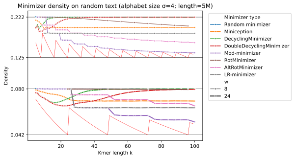

This repository hosts code for a number of different projects related to minimizers.

1. In [[file:src/lib.rs][src/lib.rs]], reference implementations for the schemes presented in the mod-minimizer
   [[https://doi.org/10.4230/LIPIcs.WABI.2024.11][paper]] with Giulio Ermanno Pibiri.
   - See also [[https://curiouscoding.nl/posts/minimizers/][this blogpost]].
   - These are also used for the lower bound [[https://doi.org/10.1101/2024.09.06.611668][paper]] with Bryce Kille:
   - Python bindings available in [[file:src/py.rs][src/py.rs]].
2. Ongoing research on new sampling schemes.
   - Plots and experiments are in [[file:py][py/]].
3. An implementation ([[file:src/schemes/anchors.rs][src/schemes/anchors.rs]]) and experiments ([[file:py/sus-anchors-1.py][py/sus-anchors-1.py]]) of SUS-anchors ([[https://arxiv.org/abs/2606.01190][arxiv]]).

The SIMD-based random-minimizers implementation corresponding to [[https://curiouscoding.nl/posts/fast-minimizers/][this post]] has moved to [[https://github.com/rust-seq/simd-minimizers]].

* Implemented minimizer schemes

- *Random minimizers*.
- two versions of asymptotically optimal *Rotational minimizers* (Marçais et al., 2018) .
- *Miniception*, and a small slightly improved variant of it.
- *Decycling* and *double decycling* based minimizers (Pellow et al., 2023).
- *Bidirectional anchors* (Loukides et al., 2023)
- *Mod-sampling*, with *lr-minimizers* and *mod-minimizers* (our work).
- *SUS-anchors*

* Reproducing results
1. Install [[https://github.com/pyo3/maturin][maturin]], the build system we use for creating python libraries out of
   Rust code.
2. Create a python environment: =just py-init= (=python -m venv -env=.) and load
   it =source .env/bin/activate=
3. Run =just py=  (=maturin develop -r=) to build
   the python library.
4. =cd py= and run =./sus-anchors-1.py= to reproduce the =sus-anchors-1.svg=
   plot in the SUS-anchors paper. Lower =n= to =100000= or so for faster results.
